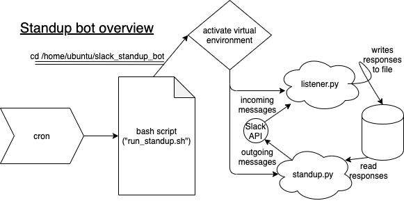

# slack_standup_bot
Request standup reports from team members and send a daily email digest of all standup reports.

Overview:
1. At 10:00 am slackbot requests standup reports containing the following information:
   * what you worked on yesterday
   * what you’re planning to working on today
   * a list of any blockers you have.
2. At 11:30 am it will send a reminder to team members who haven't responded yet.
3. At Noon it sends an email digest with all the standup reports to an email list.

Timing is configurable based on how one chooses to set up the cron job (see the architecture section below)

## Setup
1. clone this code base to a server or virtual server (I used an AWS EC2 running ubuntu)
2. create [gmail account](https://realpython.com/python-send-email/#sending-a-plain-text-email) or other mail server
3. [Get a token](https://slack.com/help/articles/215770388-Create-and-regenerate-API-tokens) for your Slack API
4. Rename `config_EDIT_ME.py` to `config.py` and:
    * add your slack token
    * add your mail server credentials
    * add emails to receive the digest
    * add slack [member IDs](https://slack.com/help/articles/360003827751-Create-a-link-to-a-members-profile-) for dynamic reminders
5. set up a cron job to run `run_standup.sh` at the time you want.
   * The EC2 server is on UTC time, so the times in the crontab need to be converted accordingly. 
   * Timing can be customized further by editing the duration that `standup.py` sleeps at after each stage. 
6. Create a virtual environment with the requirements specified in `requirements.txt`

### Setup Debugging Tips
* Ensure the path to `run_standup.sh` is correct in the crontab file.
  * Needs to be the path from the directory in which the cron job is run.

## Architecture / How it works

1. The `run_standup.sh` script is run at the time specified by the cron job
    * Edit the crontab file via crontab -e
    * The ec2 server is on UTC time, so the times in the crontab need to be converted accordingly. 
2. On start up, `standup.py` sends a message to the standup slack channel
    * Slack messages can be uniquely identified by timestamp (ts), so we store the timestamp to identity responses to the original message. We write the time stamp to a file so that `listener.py` can read it and only record messages that are in response to a message with that timestamp.
    * After sending the message, and persisting the timestamp, this script sleeps for 90 minutes.
3. `listener.py` is a listening server that waits for message events in the slack API and persists them in msg_lst (a pickle file) if they are responses to the standup message (using the timestamp)
4. After 90 minutes of sleeping, the `standup.py` script sends a message to the people who haven’t responded. Then it sleeps for another 30 minutes.
5. Finally, the `standup.py` script reads all the messages persisted in mgs_lst and emails people according to `config.py`.
    * `config.py` also stores the slack API key.

